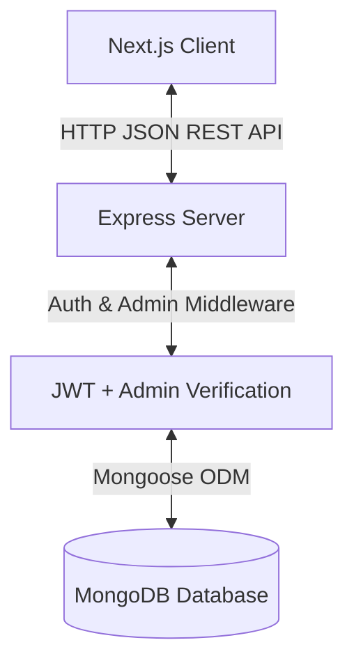

# Stepkick — Node.js & Express Backend Implementation Guide

Welcome to the backend engineering guide for **Stepkick**! This document provides the complete blueprints, database schemas, REST endpoints, and security layers needed to build a secure Full-Stack API server using **Node.js**, **Express**, and **MongoDB** (with Mongoose).

---

## 🏗 1. System Architecture

The frontend (Next.js) communicates with the backend (Node/Express) via JSON payloads over HTTP. Private user actions and admin tasks are protected by a double-layer JSON Web Token (JWT) security middleware.



---

## 🗄 2. Exhaustive Database Models (Schemas)

### A. User & Admin Model (`User`)
Tracks registration data, profile statistics, Goodyear-welt resole milestones, and wishlist state.
* **Mongoose Schema Definition:**
```javascript
const mongoose = require('mongoose');

const UserSchema = new mongoose.Schema({
  name: { type: String, required: true },
  email: { type: String, required: true, unique: true },
  password: { type: String, required: true },
  isAdmin: { type: Boolean, default: false }, // Grants access to Admin Panel routes
  memberTier: { type: String, default: "Standard", enum: ["Standard", "Silver", "Gold"] },
  stepsCount: { type: Number, default: 0 }, // For resole milestone: e.g. "450,000 steps until free resole"
  savedWishlist: [{ type: mongoose.Schema.Types.ObjectId, ref: 'Product' }],
  shippingAddress: {
    street: String,
    apartment: String,
    city: String,
    postalCode: String,
    country: String
  }
}, { timestamps: true });

module.exports = mongoose.model('User', UserSchema);
```

### B. Product Model (`Product`)
Stores shoe assets, detail copies, and available stock map items.
* **Mongoose Schema Definition:**
```javascript
const ProductSchema = new mongoose.Schema({
  name: { type: String, required: true },
  tag: { type: String, required: true }, // e.g. "Everyday Leather"
  price: { type: Number, required: true },
  img: { type: String, required: true }, // URL path (e.g. "/shoes/shoes1.png")
  colors: [{ type: String }], // Hex codes, e.g. ["#f4ecdf", "#1c1c1c"]
  colorNames: [{ type: String }], // e.g. ["Parchment", "Obsidian"]
  description: { type: String, required: true },
  features: [{ type: String }], // Bullet list items
  sizesStock: {
    type: Map,
    of: Number, // E.g., { "EU 41": 15, "EU 42": 0 }
    required: true
  }
}, { timestamps: true });

module.exports = mongoose.model('Product', ProductSchema);
```

### C. Order Model (`Order`)
Tracks purchasing transactions. Both customers (for order tracking) and Admins (for shipment processing) interact with this.
* **Mongoose Schema Definition:**
```javascript
const OrderSchema = new mongoose.Schema({
  user: { type: mongoose.Schema.Types.ObjectId, ref: 'User', default: null }, // Null for Guest Checkout
  items: [{
    productId: { type: mongoose.Schema.Types.ObjectId, ref: 'Product', required: true },
    name: { type: String, required: true },
    color: { type: String, required: true },
    size: { type: String, required: true },
    qty: { type: Number, required: true },
    price: { type: Number, required: true }
  }],
  subtotal: { type: Number, required: true },
  shippingCost: { type: Number, required: true, default: 0 },
  total: { type: Number, required: true },
  shippingAddress: {
    name: { type: String, required: true },
    street: { type: String, required: true },
    apartment: String,
    city: { type: String, required: true },
    postalCode: { type: String, required: true },
    country: { type: String, required: true }
  },
  paymentStatus: { type: String, default: "pending", enum: ["pending", "paid", "failed"] },
  status: { 
    type: String, 
    default: "Confirmed", 
    enum: ["Confirmed", "In Assembly", "Shipped", "Out for Delivery", "Delivered"] 
  },
  carrier: { type: String, default: "DHL Express" },
  estDelivery: { type: Date }
}, { timestamps: true });

module.exports = mongoose.model('Order', OrderSchema);
```

### D. Tracking Model (`Tracking`)
Stores checkpoint timelines for shipping logs.
* **Mongoose Schema Definition:**
```javascript
const TrackingSchema = new mongoose.Schema({
  orderId: { type: mongoose.Schema.Types.ObjectId, ref: 'Order', required: true },
  history: [{
    status: { type: String, required: true },
    title: { type: String, required: true },
    desc: { type: String, required: true },
    location: { type: String, required: true },
    time: { type: Date, default: Date.now },
    isCompleted: { type: Boolean, default: true }
  }]
});

module.exports = mongoose.model('Tracking', TrackingSchema);
```

---

## 🛣 3. REST API Routes & Endpoints

| Method | Endpoint | Access Level | Description |
| :--- | :--- | :--- | :--- |
| **GET** | `/api/products` | Public | Fetch all products (supports query parameters for categories, keywords, and prices). |
| **GET** | `/api/products/:id` | Public | Fetch details for a specific shoe. |
| **POST** | `/api/users/register` | Public | Registers a user account (hashes passwords). |
| **POST** | `/api/users/login` | Public | Logs in a user (returns signed JWT). |
| **GET** | `/api/users/profile` | Protected | Fetch logged-in user profile, tier, and resole steps. |
| **PUT** | `/api/users/profile` | Protected | Update profile settings/shipping addresses. |
| **POST** | `/api/users/wishlist` | Protected | Toggles a product ID in user's saved wishlist array. |
| **POST** | `/api/orders` | Public / Prot | Places a new order, calculates totals, deducts stock, and initiates tracking. |
| **GET** | `/api/orders/:id` | Public / Prot | Fetch details of a specific order. |
| **GET** | `/api/orders/track/:id` | Public | Fetch the vertical tracking history list for a package. |
| **GET** | `/api/admin/orders` | Admin Only | List all customer orders placed on the system. |
| **PUT** | `/api/admin/orders/:id/status`| Admin Only | Update shipping status and automatically append a new event checkpoint. |
| **GET** | `/api/admin/users` | Admin Only | View list of registered accounts. |
| **POST** | `/api/admin/products` | Admin Only | Add a new shoe to the database catalog. |
| **PUT** | `/api/admin/products/:id`| Admin Only | Edit pricing, metadata, or restock stock volumes. |
| **DELETE**| `/api/admin/products/:id`| Admin Only | Soft-delete or remove a shoe from the catalog. |

---

## 🔒 4. Security Middlewares

To check JWT headers and enforce Administrator access controls, use these middlewares:

### Authentication Verification Middleware (`middleware/auth.js`)
```javascript
const jwt = require('jsonwebtoken');

module.exports = function(req, res, next) {
  const token = req.header('Authorization')?.split(' ')[1]; // Expects "Bearer <token>"
  if (!token) return res.status(401).json({ msg: "No token, authorization denied" });
  
  try {
    const decoded = jwt.verify(token, process.env.JWT_SECRET);
    req.userId = decoded.userId;
    req.isAdmin = decoded.isAdmin; // Payload parameter
    next();
  } catch (err) {
    res.status(401).json({ msg: "Token is not valid" });
  }
};
```

### Admin Access Checking Middleware (`middleware/admin.js`)
```javascript
module.exports = function(req, res, next) {
  if (!req.isAdmin) {
    return res.status(403).json({ msg: "Access denied. Administrator privileges required." });
  }
  next();
};
```

---

## ⚙️ 5. Admin Order Status Update Workflow

Below is the Express route implementation handling order status progression. When an Admin triggers this endpoint, it updates the `Order` document and pushes a matching history event to the `Tracking` timeline:

```javascript
const express = require('express');
const router = express.Router();
const auth = require('../middleware/auth');
const admin = require('../middleware/admin');
const Order = require('../models/Order');
const Tracking = require('../models/Tracking');

router.put('/orders/:id/status', [auth, admin], async (req, res) => {
  const { status, location, description } = req.body;
  const allowedStatuses = ["Confirmed", "In Assembly", "Shipped", "Out for Delivery", "Delivered"];

  if (!allowedStatuses.includes(status)) {
    return res.status(400).json({ msg: "Invalid order status state." });
  }

  try {
    // 1. Update status on the Order
    const order = await Order.findByIdAndUpdate(
      req.params.id,
      { status: status },
      { new: true }
    );

    if (!order) return res.status(404).json({ msg: "Order not found" });

    // 2. Append new event checkpoint to the Tracking history
    const newCheckpoint = {
      status: status,
      title: `Order Updated: ${status}`,
      desc: description || `Your order status was updated to ${status}.`,
      location: location || "Stepkick Logistics Depot",
      time: new Date(),
      isCompleted: true
    };

    await Tracking.findOneAndUpdate(
      { orderId: order._id },
      { $push: { history: newCheckpoint } },
      { upsert: true, new: true }
    );

    res.json({ msg: "Order status & tracking timeline updated successfully", order });
  } catch (err) {
    res.status(500).json({ error: err.message });
  }
});

module.exports = router;
```

---

## 🛠 6. Development Tools & Packages
Initialize your Node project inside the `/backend` folder:
```bash
npm init -y
npm install express cors dotenv mongoose bcryptjs jsonwebtoken
npm install --save-dev typescript @types/node @types/express nodemon tsx
```

* **`express`**: Lightweight HTTP request router.
* **`cors`**: Allows cross-origin connection between port `3000` (Next.js) and `5000` (Node/Express).
* **`dotenv`**: Securely loads environment credentials from `.env`.
* **`mongoose`**: Database model constructor and query orchestrator.
* **`bcryptjs`**: Hashes passwords safely.
* **`jsonwebtoken`**: Sign sessions token headers.

---

## 🚀 7. Recommended Implementation Sequence
1. **Express Server:** Set up basic CORS, JSON parsing, and listening server on port `5000`.
2. **Database Connect:** Hook Mongoose to a MongoDB Atlas cluster.
3. **Seed Catalog:** Write the `Product` model schema and insert mock shoes data.
4. **Auth APIs:** Build registration, login, and verify routes with password hashing.
5. **Admin Testing:** Modify one User's `isAdmin` property directly in the MongoDB cluster database to test protection middlewares.
6. **Orders & Checkout:** Build secure price calculation functions to process customer carts, subtract stock maps, and create initial timelines.
7. **Timeline Updates:** Test the update endpoint using Postman/Insomnia by updating status strings and watching the timeline sync.
